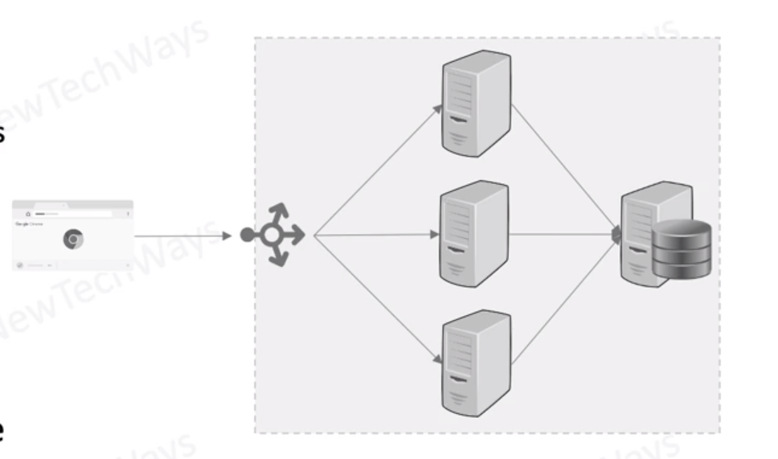

# Failures in Large-Scale Systems

- Large scale systems are generally distributed systems
  - Large number of components
  - large number of component instances
- Failures can be
  - partial
  - independent
  - single point of failures
- increased chance of partial failures
- partial failures can lead to complete system failures

