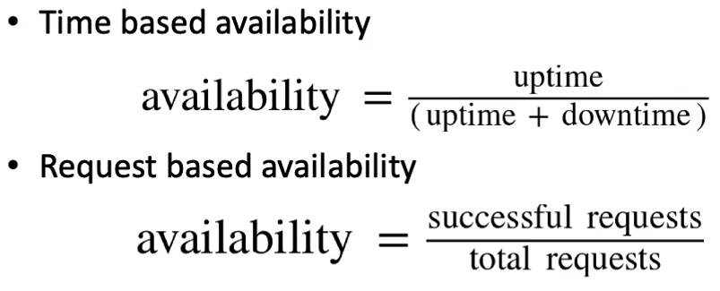

# Availability

- It is the probability of a system working correctly at any given time and being available for operations

- there can be downtime but the system is expected to recover from the same in a quick time