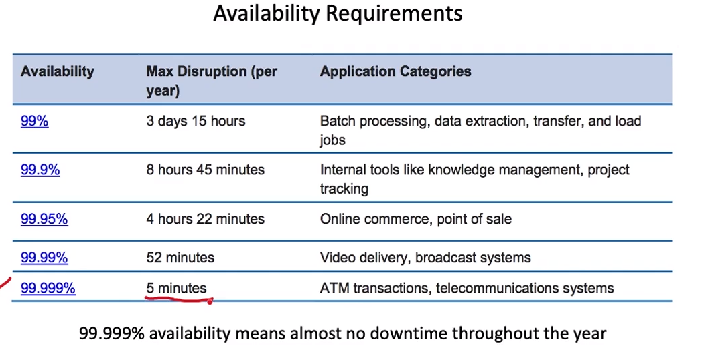

# High Availability

- Availability requirements should come from the impact of availability on a business
- beyond business availability is at the cost of
  - new features
  - operation costs
- the system should use downtimes permitted by SLA/SLO for rollout of new features
  - new feature rollouts invariably cause disruptions

