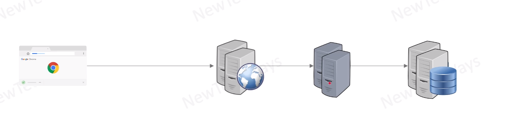

# Redundancy
- Replication/duplication of critical components or functions of a system in order to increase its reliability
- a secondary capacity is kept ready as a backup over and aboce the primary capacity, in case the primary is not available

