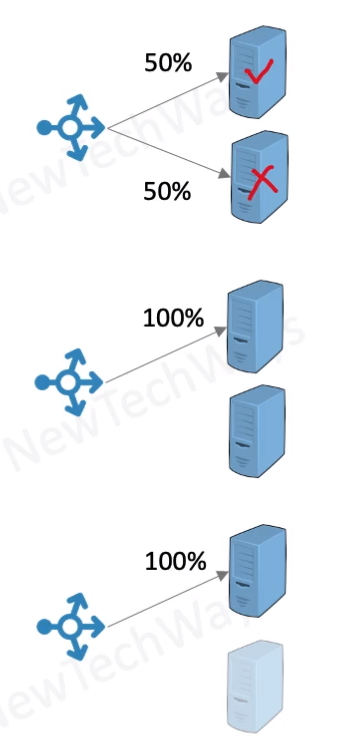

# Types of Redundancy

- Active Redundancy - hot spare
  - all nodes do the processing
  - ideal for providing highest availability
- passive redundancy - warm spare
  - only actives nodes do the processing
  - ideal for quick recovery
- cold redundancy - spare (backup)
  - Spare nodes are brought up only on a failover
  - it is not a high availability option

