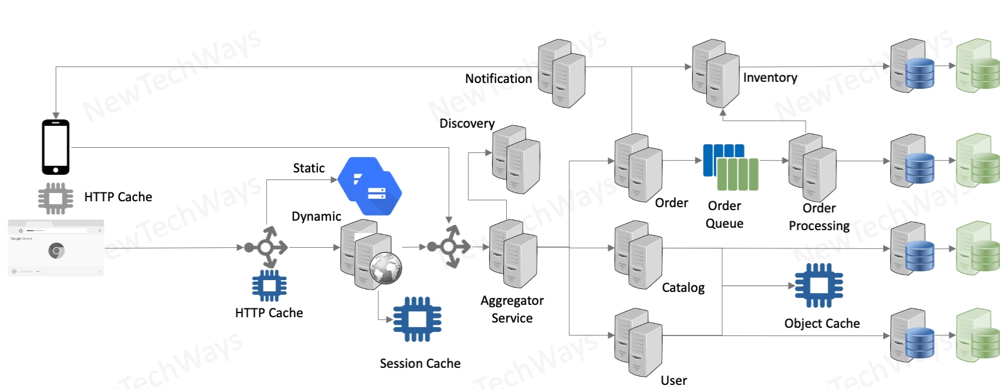

# Redundancy for Stateful Components

databases
- primary / secondary
- active /passive replica
- synchronous replication
  - slower
  - lower chance to lose data
- asynchronous replication
  - faster
  - higher chance to lose data

msg queues
- mechanism is the same like for the databases

content server
- data is immutable so you do not worry about any changes

Caches
- do we need redundancy for it?
- it is not primary source of data