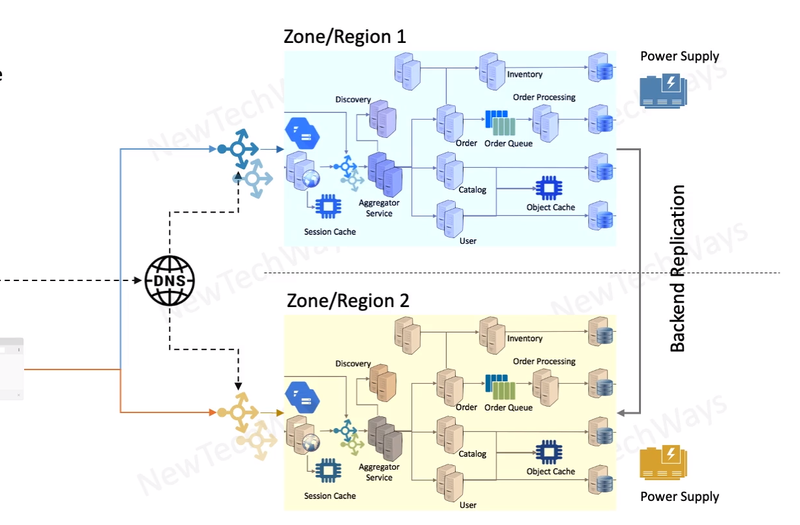

# Datacenter Redundancy

- fault isolation
  - independent infrastructure
- Zonal Redundancy 
  - High Availability
  - active-active setup
- Regional Redundancy
  - Disaster Recovery
  - Active-passive setup

