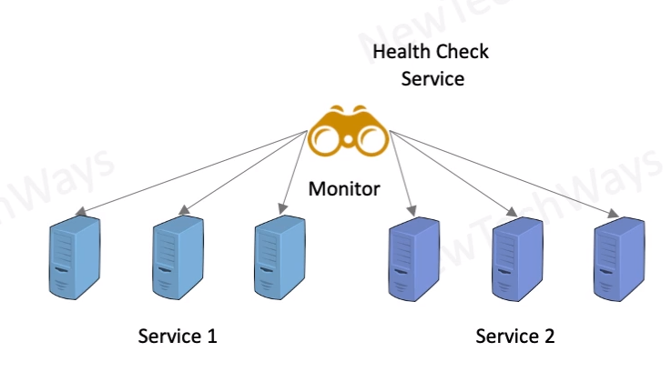

# External Monitoring service

- Health check service generates
  - alerts - for recovery
  - events - for scaling
- Application Health Checks
  - HTTP Response
  - TCP Response
- Periodic Health Checks
  - Response Code
  - Response Time
  - Number of Retries
    - up
    - down

