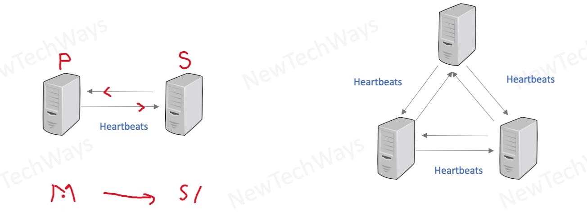
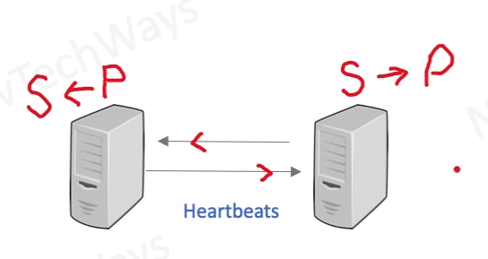

# Internal Cluster Monitoring

- Periodic exchange of heartbeats between redundancy cluster nodes
  - Requires protocols for communication and recovery
- Useful for stateful cluster components
  - Examples are NoSQL DB and Load Balancers

So it is like "aware monitoring"

So Service instance know if something happened in other instance

! it is complicated to achieve
So it is mostly done only for:
- databases 
- load balancers