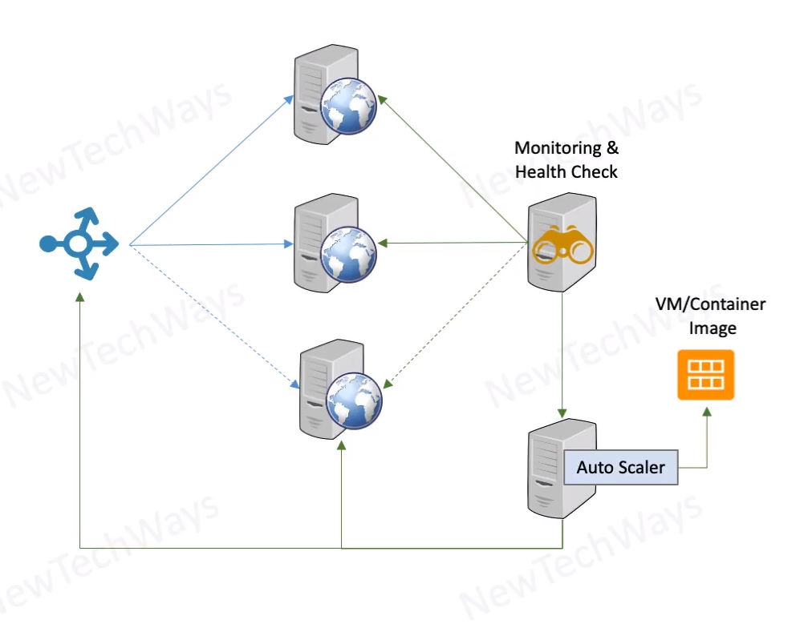

# Stateless Recovery

- Can use existing scalability mechanism for recovery
- Hot standby
  - have active redundant instances up and running
- Warm standby
  - Bring up new instances as and when needed
  - terminate unhealthy instances if not dead already
  - launch a new instance

