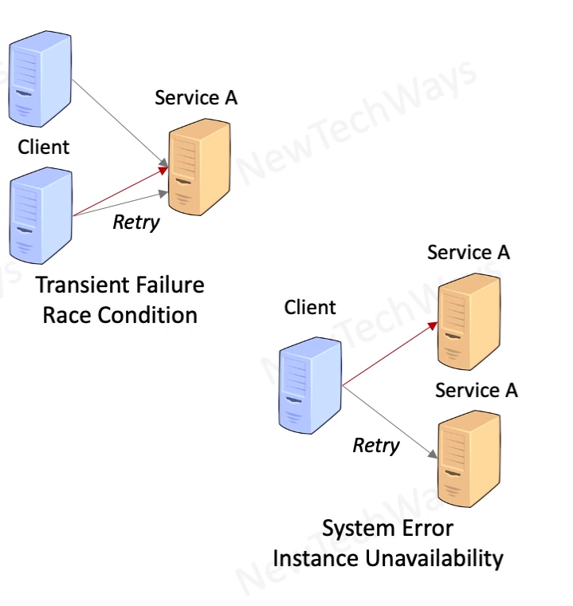

# Retries
- Client Components
- For transient failures
  - not for permanent failures
- for system errors
  - not for application errors
- retries with exponential back-off
- return http 503
  - clients can decide if and when to callback again
- Use idempotent tokens
  - for unacknowledged failed requests
  - at least once guarantee instead of exactly one

