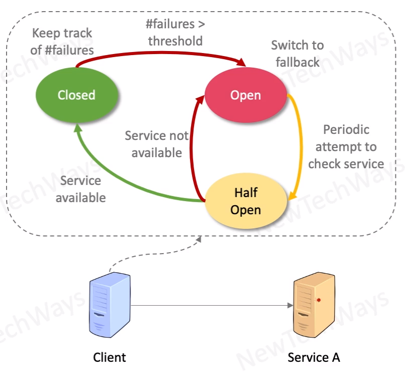

# Circuit Breaker

- Client Components
- Deliberate service degradation when a system is under stress and a problem is detected
- process
  - Keep track of success and failures
  - in the event of too many failures, fallback to:
    - default values
    - cached values
    - error msg
  - resume when stress dissipates

