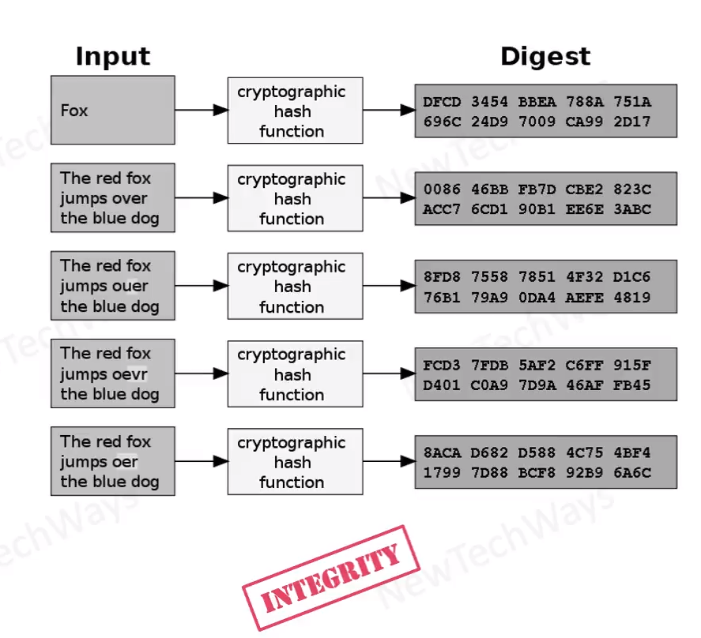

# Hashing

- Generates a value or values from a string of text using mathematical function
  - MD-5 (Message Digest)
    - 128 bits
    - Has collisions vulnerability
  - SHA-1 (Secure Hash Algorithm)
    - 160 bits
  - SHA-2
    - 256 bits
    - 512 bits
- Generates same output for same text
- Hashing is a one-way algorithm
- Slightest change in the text changes the hash value drastically

