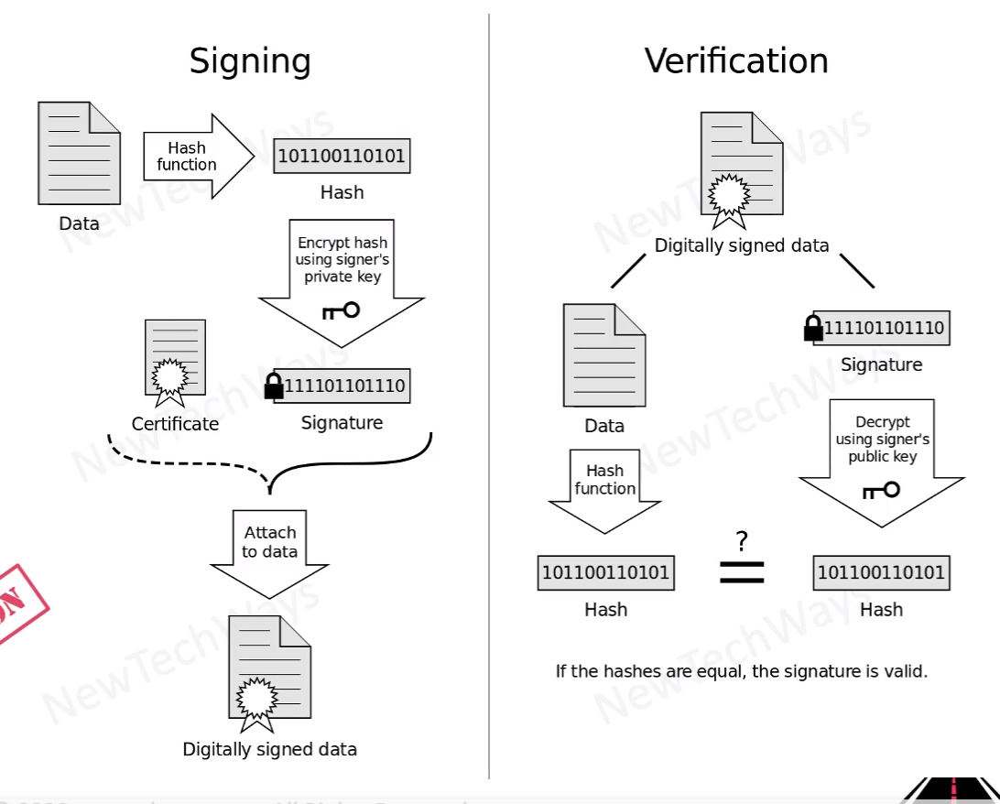

# Digital Signatures

- encrypted hash of a message
- encrypted using signer's private key
- verified using public key of signer
- message is hashed independently and compared with the hash present in the signature

