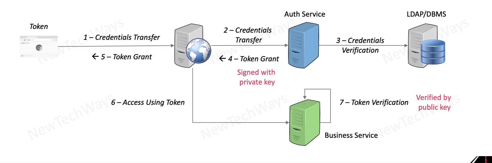

# Stateless Authentication
- Signed or encrypted tokens with
  - id, 
  - name,
  - role
  - etc
- Decentralized authentication leads to better scalability
- requires centralized store for immediate token revocation

