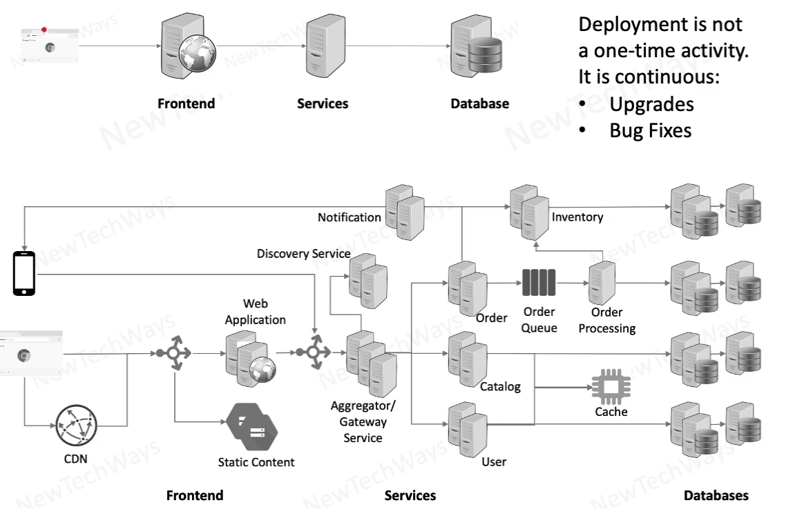

# Application Deployment

- Web Apps
  - Replicas
- Services
  - Microservices and replicas
- Databases 
  - RDBMS, No SQL
  - Replication and partitioning
- message queues
  - replication and partitioning
- caches
- directory servers / LDAP
- content storage
- log file storage
- search and analytics

