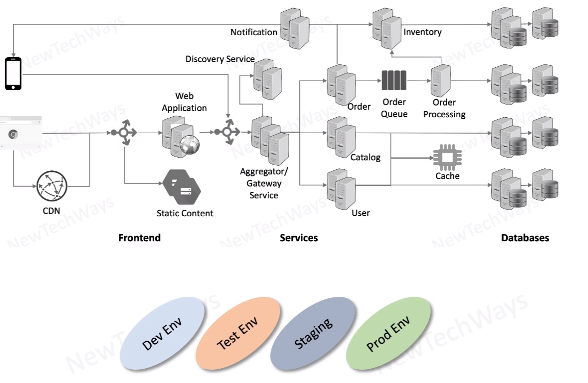

# Infrastructure Deployment

- Compute Infrastructure
  - compute VMS
    - cpu
    - ram
    - disks
- network
  - routing, domains
    - datacenters
  - internet access
  - secure access
    - firewall, certificates
- Load balancers
  - hlb 
  - slb
- DNS and discovery services
- storage
  - content
  - vm / container images
  - backups
  - logs
- mail servers
- cdn

