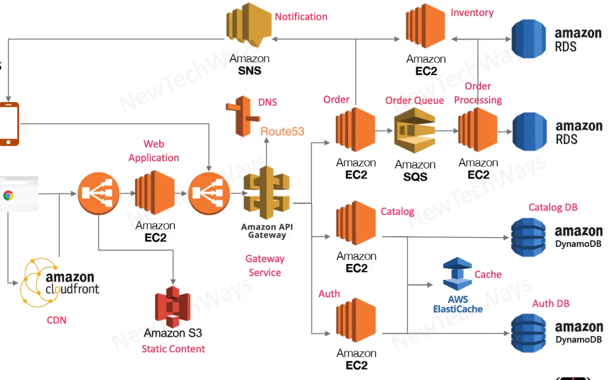

# Deployment with Cloud Stack

- Compute VM 
  - on demand
  - multiple global locations
- Serverless compute
- network
  - global connectivity
  - firewalls
- fully cloud managed services
  - load balancers
    - external
    - internal
  - databases
    - rdbms
    - nosql
  - storage
    - content
    - backups
  - logging and monitoring

