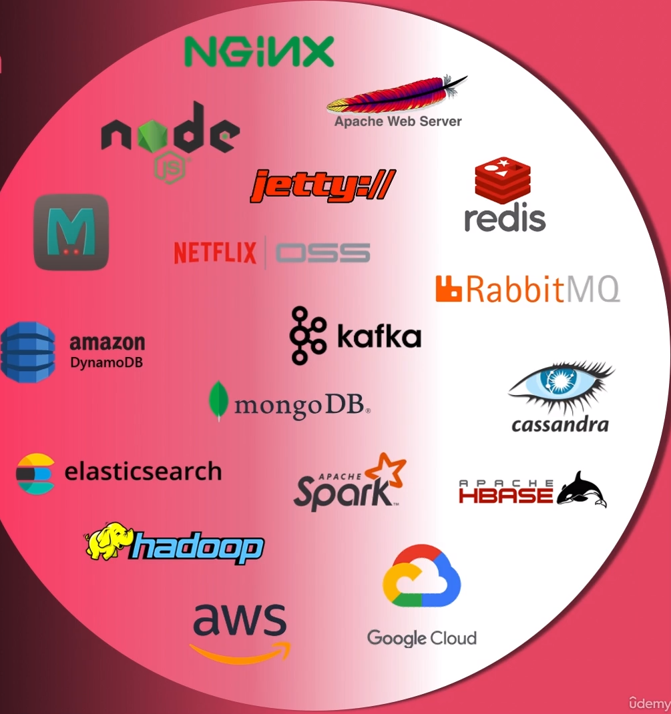

# Architecting Solutions With Platform and Frameworks

- Platforms for
  - web apps
  - services
  - datastores
  - analytics
- platform functionality
- platform architecture
  - performance
  - scalability
  - reliability
- platform use-cases
- platform alternative
  - comparison
- architecting solution
  - end to end

