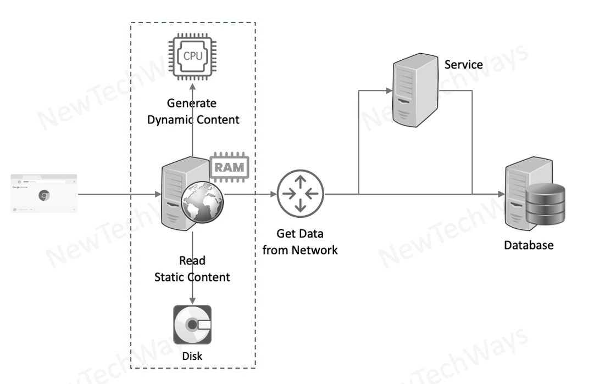

# Apache Webserver

- Store Static Content
  - htlm css js files
  - image files
  - documents
- Generate Dynamic Content
  - get data and generate pages dynamically
  - php, python, perl
  - no jsp/servlets
- act as a reverse proxy

