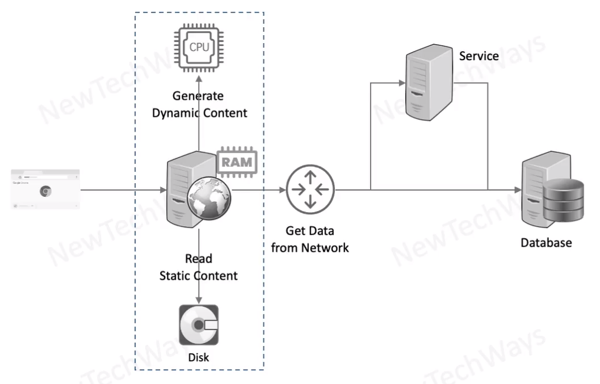

# NGINX Webserver

- Store Static Content
  - html/CSS/JS fil;es
  - image files
  - documents
- Generate Dynamic Content
  - not the best
- Act as a Reverse Proxy
  - Excellent
- Cache Content
  - Good

