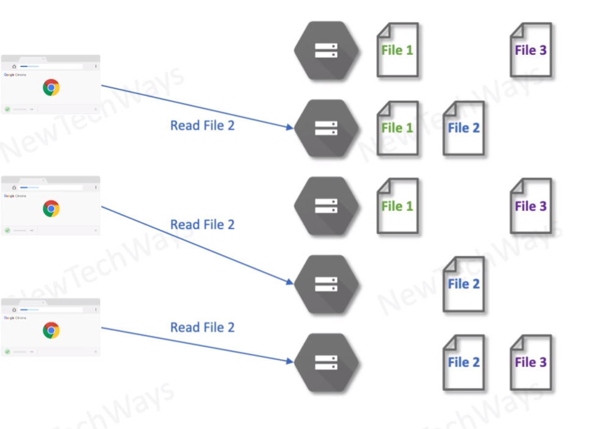

# Cloud Storage

- Unlimited disk space
- version control
- access control
- low latency
  - no overhead of directory structure
- high throughput
  - parallel clients
  - large files can be broken into smaller chunks for parallel read
- high availability and reliability
  - multiple copies
  - multiple physical locations
- static website creation``

