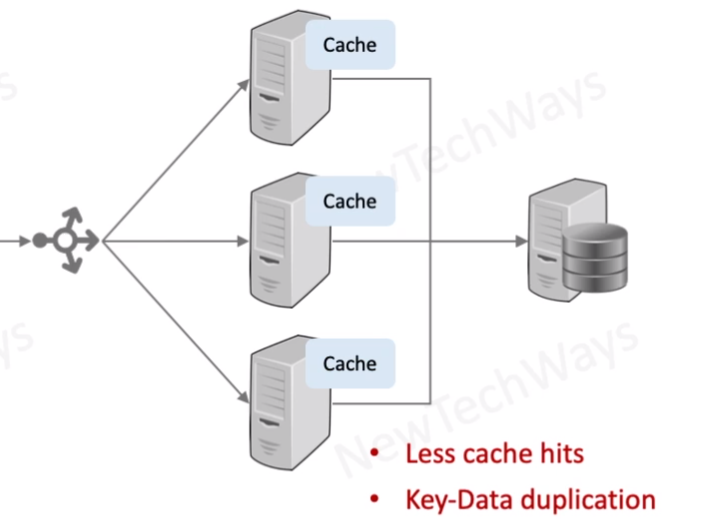
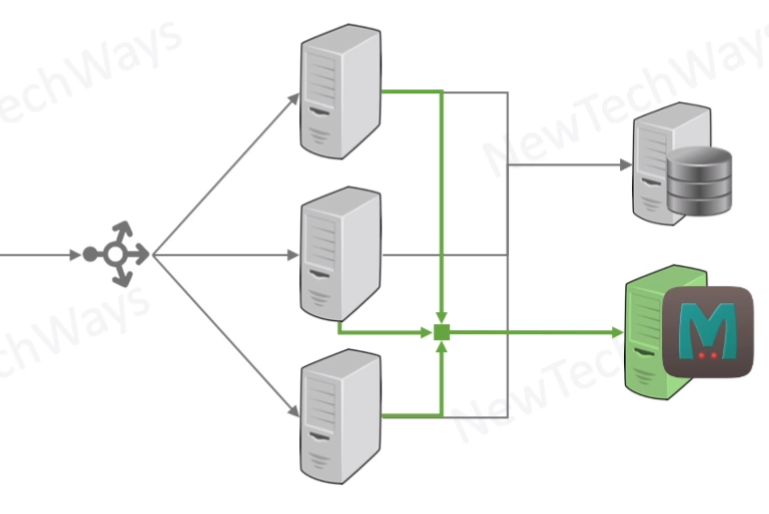

# Memcached

- Stores key value pairs
- values can be
  - any blob
  - any size
    - preferred < 1mb
    - Max is configurable
- centralized cache

- TTL can be set differently for a each data
- eviction expunges expired data followed by LRU data
- 