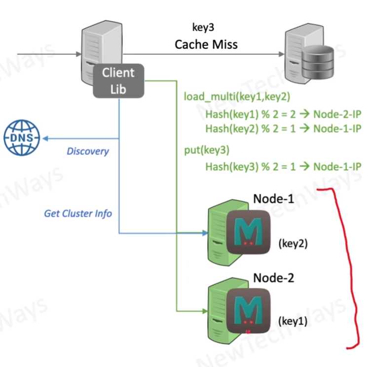

# Memcached Architecture

- Cache-aside pattern
- sub-millisecond latency
- horizontally scalable
  - data is partitioned
- High throughput
  - parallel operations
- cluster aware client library
  - consistent hashing for resolving a node
- node failure is treated as a cache miss
  - use large number of nodes with less data
- data is lost if a node crashes or restarted

