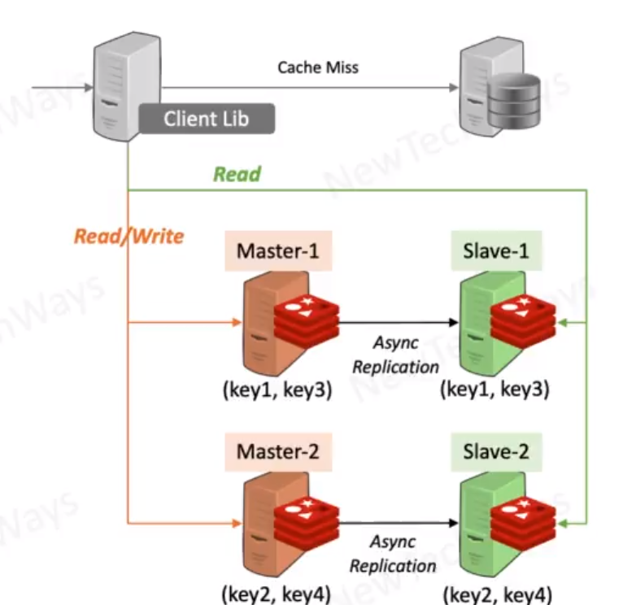

# Redis Cache and Its Architecture

- much like memcached
- it is a [Key -> Data Structure] store 
  - strings, lists, sortedsets, maps
- data-store mode for persistance
  - stores data on disk 
  - allows backups
  - can be started pre-populated with a backup
- data replication
  - asynchronous and synchronous
  - read load distribution
  - high availability
- can also be used as a messaging queue
- data store mode requires fixed number of nodes
  - cache mode is suitable for node scaling

