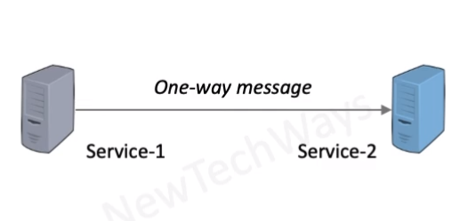
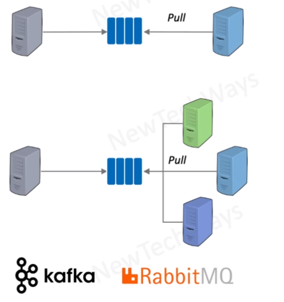
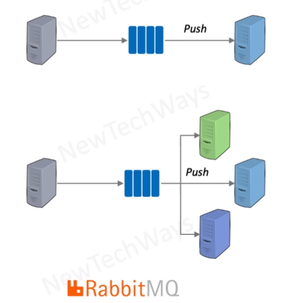

# RabbitMQ

- Design Goals
  - At-Least-Once Delivery
  - Message Sequencing - FIFO
  - Interface Decoupling
  - Consumer Decoupling
  - Message Rate Decoupling
- Consumer Mode
  - push 
  - pull
- use cases
  - Service integration
  - message buffer
  
  
  
  