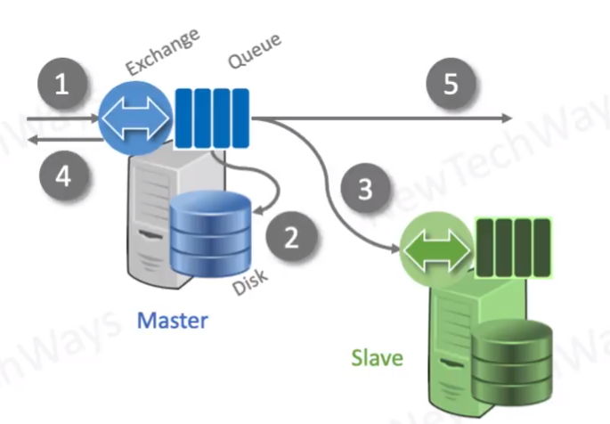

# Rabbit MQ

- General purpose message broker
- message are pushed to consumers
- message deleted once acknowledged 
- message ordering is guaranteed
- useful for asynchronous service integration
- both persistent and transient messages are supported
- uses built-in component called exchange for routing
- Scales to 50k messages per second
- scales well vartically
- not horizontal scalable
  - master-slave replication for high availability
    - clients can connect to any node
    - all publish consume operations first go to master

