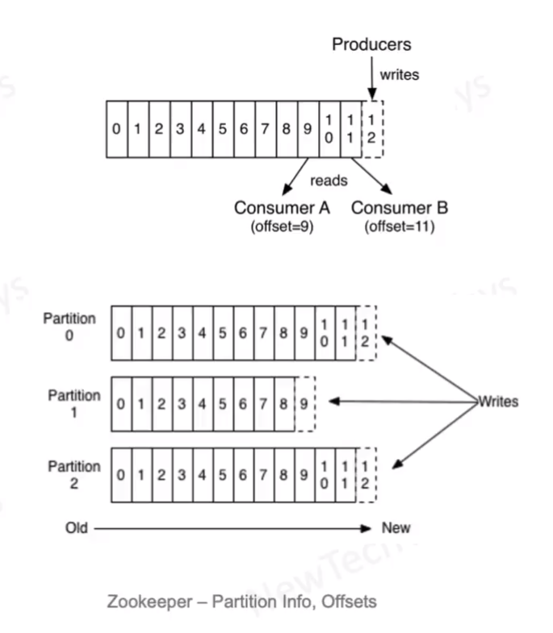

# Kafka

- Performance 
  - million messages per second
  - sequential writes and reads on log files
  - relies on page cache for quick reads
- horizontal scalable
  - topic are partitioned
- order of data quaranteed only within a partition
  - producer can decide the partition
- messages are not deleted, so can be replayed
- consumers can only pull the data 
  - no push by kafka
  - not designed for service integration
- useful for streaming analytical workloads
  - where high throughput is required
  - click streams, page views, logging, ingestion, security

