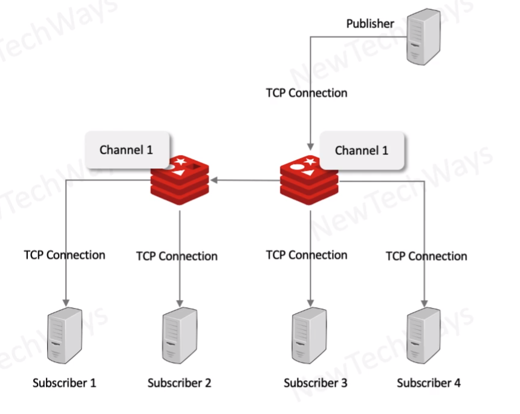

# Redis Pub/Sub

- For short lived messages with no persistance
  - much l;ike a synchronous call
  - fire and forget
    - no delivery quarantee
  - million operations per second
  - useful for making dasboards
    - leaderboard
  - comparison
    - kafka
      - no push
      - writes to log
    - rabbit mq transient
      - delivery acknowladgmenet
      - deletion of delivered messages

