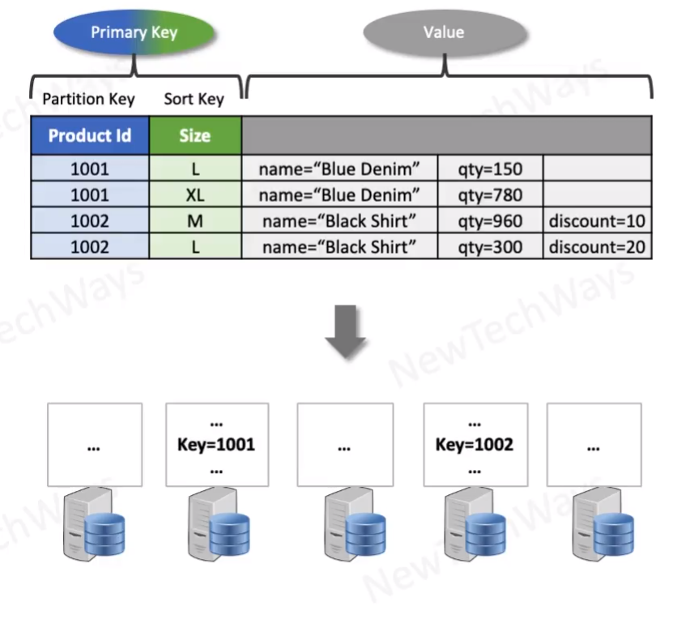

# Amazon Dynamo DB

- Key-value pair datastore
- used for high scalability and availability
- table is a hash-map
  - persistent
  - distributed
- API
  - put, get, update, delete, query
- Index key - has two parts
  - partition key
    - can have only one attribute
    - key is hashed to determine the partition
  - sort key
    - determines sort order of an item within a partition
    - can be used for range query <, >, like
  - r/w ops for a key are atomic

