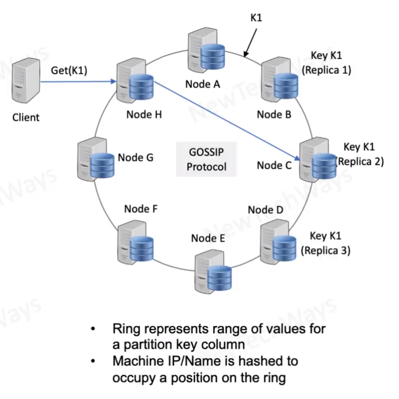

# Dynamo DB Architecture
- Suitable for storing small chunks of data
  - Key values less than 1MB
- Peer-to-peer cluster
  - nop master write on any node
  - each node responsible for a set of keys
  - consistent hashing of virtual nodes for key allocation
- high scalable 
  - practically any number of nodes
  - petabytes of data
  - can handle 10 million RW ops requests/second
- high availability
  - updates are not rejected even in case of network partitions or server failures
  - vector clock and business rules to resolve merge conflicts
- consistency quarantee is adjustable
  - R+w > N for strong consistency

