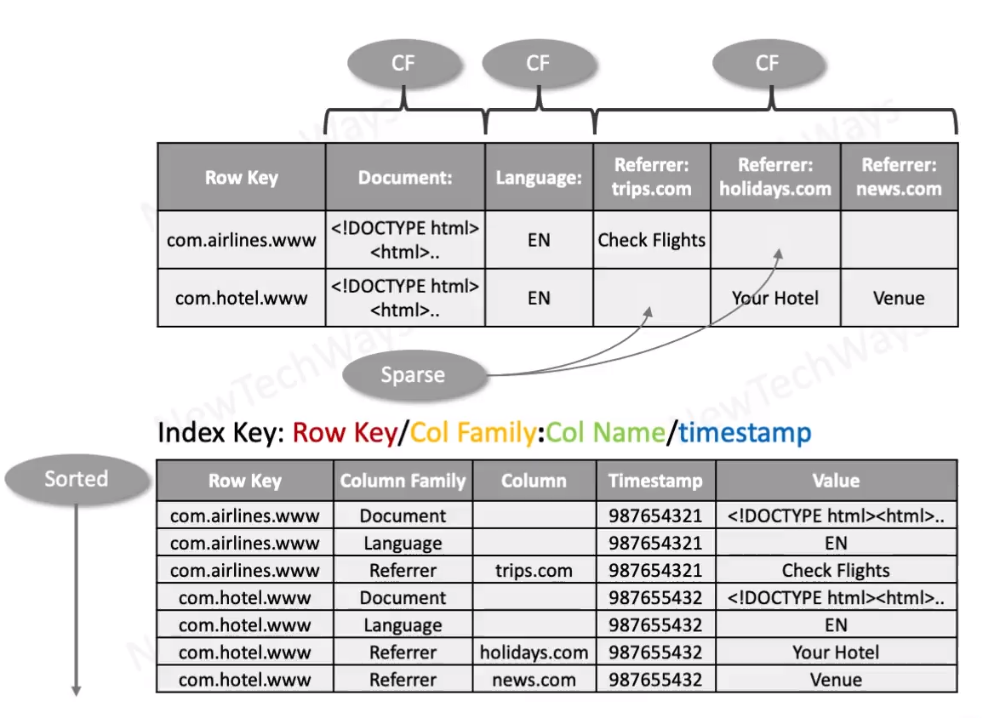

# Google Big Table

- Basic for Apache HBase
- Column-family storage
- Table as Tree-map
  - sparse 
  - sorted
  - persistent
  - distributed
- limited CF (<100)
- CFs are compressed
- Unlimited columns
- R/W ops atomic for a key
- Timestamps for versioning

