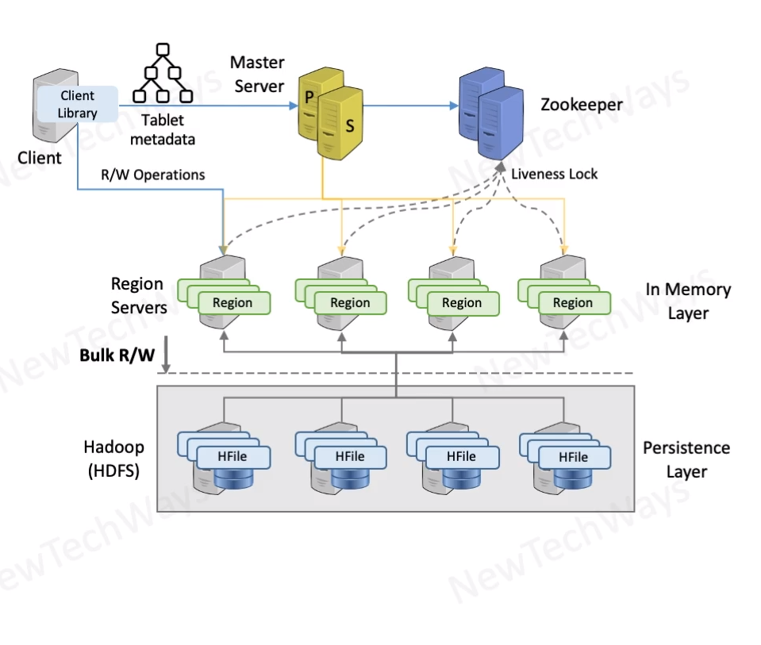

# HBase
- Open source implementation of Bigtable
- Column Family schema
- keys are range partitioned
- storage on hadoop HDFS
- strong consistency over high availability
- high scalable
- high throughput and low latency

