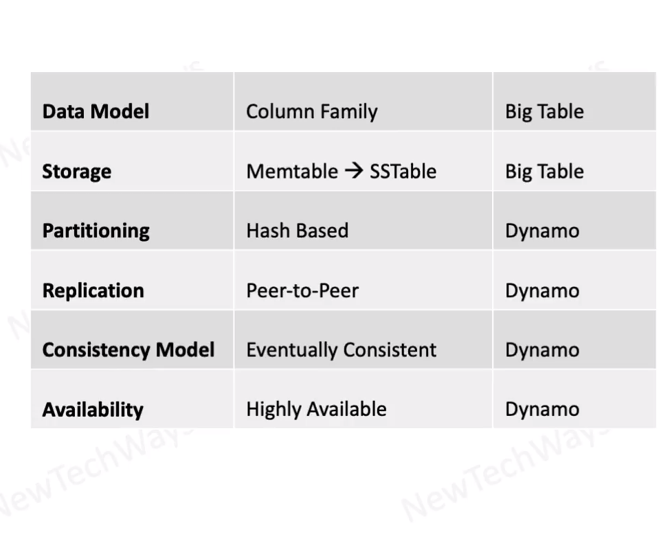

# Cassandra Features
- Schema-less, Column-Family structured Data
  - Sparse
  - Persistent
  - Distributed
- Horizontally Scalable
  - Petabytes of data
- Highly Available
  - Even during network partitions
- high throughput R/W operations
- Merge Conflicts
  - Vector clocks
  - timestamps
  - business rules

