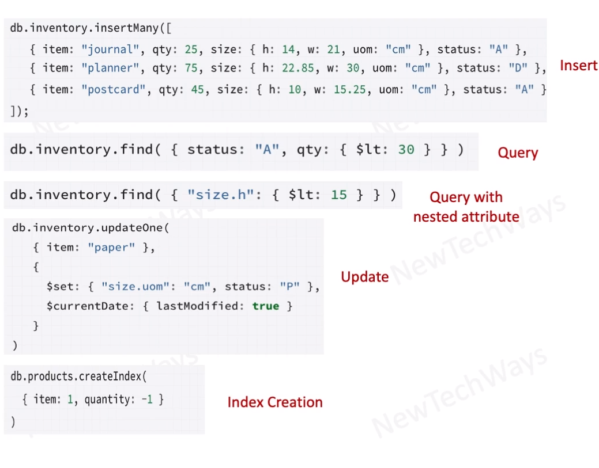

# MongoDB
- Key -> Document
  - in Binary JSON (BSON) format
- Columns created dynamically
- Columns can be indexed
- Documents can be queried
  - on id and or column values
- an operation on a single document is atomic
  - 2 PC for multiple documents

