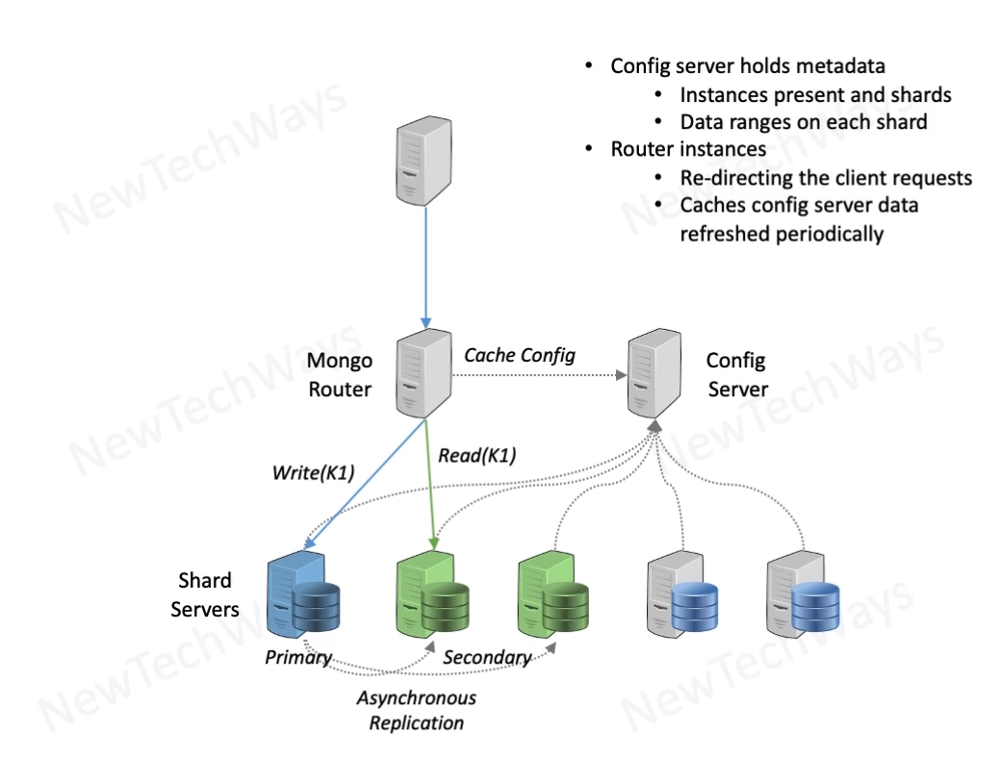

# MongoDB Architecture
- Indexing for fast search
  - its a write overhead
- sharding for scalability
  - range sharding
  - hash sharding
- replication
  - master slave
    - no write conflicts
  - asynchronous default
    - eventual consistency
  - synchronous - on demand
- works very well with node.js
  - javascript->node.js->mongo
    - json format

