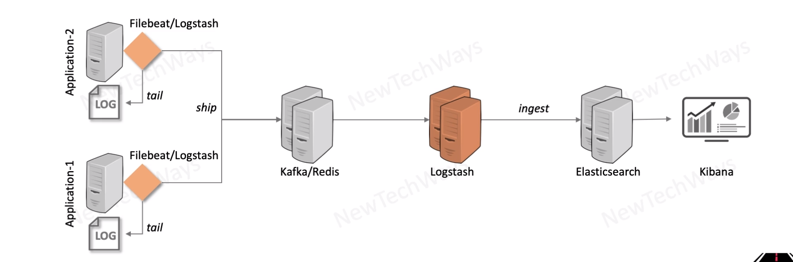

# Logstash Data Streaming Architecture

- Streaming log data for Real-Time Analytics
- Horizontally Scalable & Highly Available - Any number of Logstash nodes
- Fault Tolerance - needs reliable disk storage (RAID, Cloud Persistent disks)
- Use Kafka as buffer - For heavy load that Logstash Queue cannot handle

