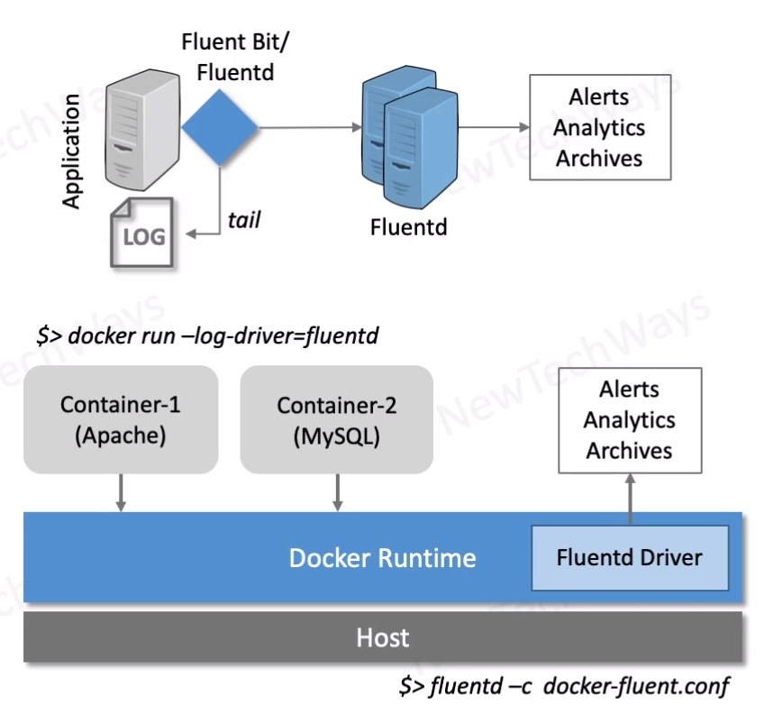

# Fluentd

- Older than logstash
- memory footprint
  - logstash - Heavyweight (GB)
  - Filebeat - Lightweight (MB)
  - Fluentd - Lightweight (MB)
  - Fluent Bit - Super Lightweight (KB)
- All Features of Logstash
- + Routing
  - Tags
- + Docker Logging
  - Picks log events from container console

