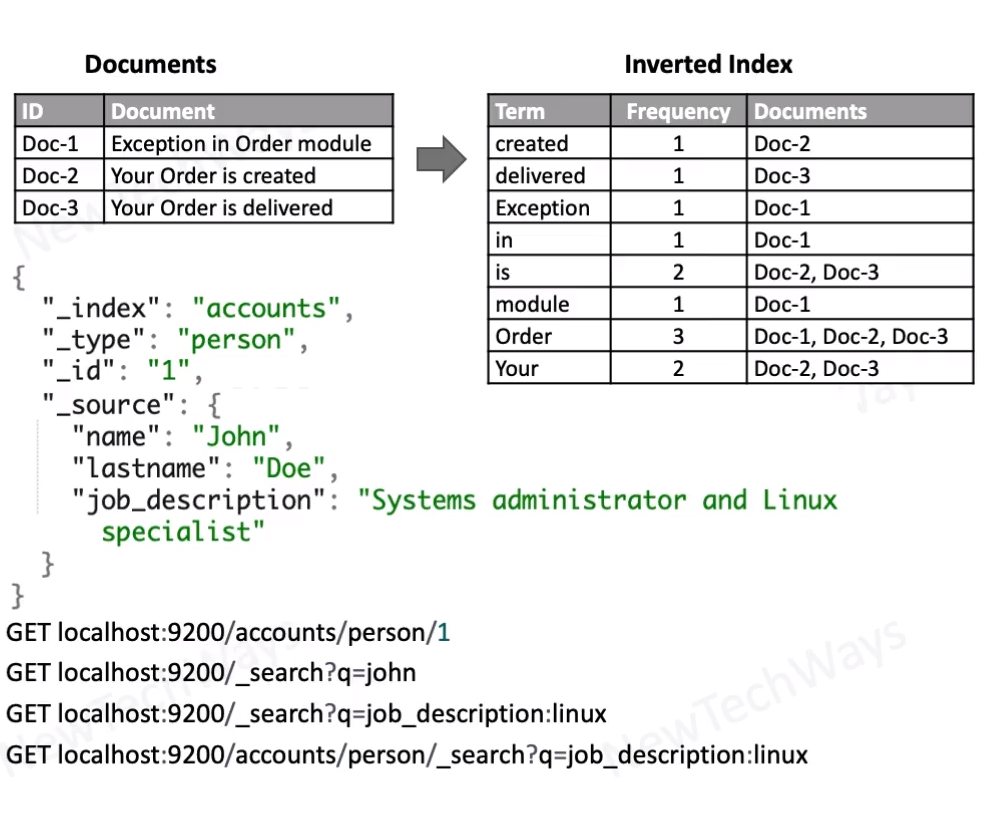

# Elasticsearch
- full-text search
  - filter
  - group
  - aggregate
- store JSON Documents
- Document Fetched using id
- indexes JSON keys and values
- structure
  - index -> Database
  - type -> table
    - json keys are flattened
  - supports data types
- Users can specify mapping between terms and documents

