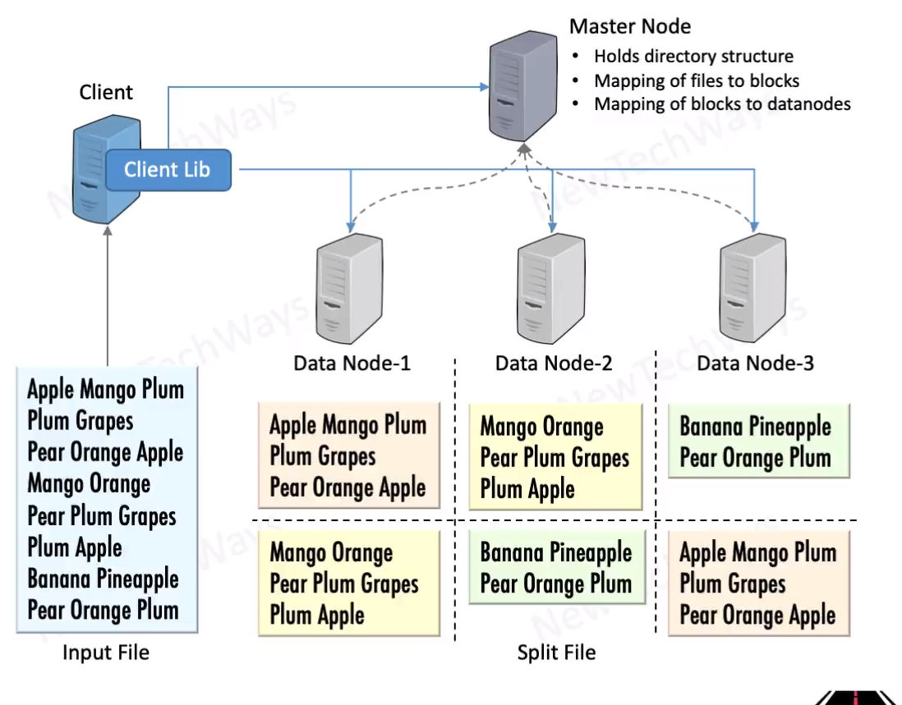

# Hadoop HDFS

- Distributed File Data Storage
  - unstructured data files
  - petabytes of data
  - large file size > 100MB
- Distributed files
  - files broken into chunks
  - for parallel reads
    - map-reduce
- sequential writes - append
  - large blocks of data - 64MB
- replication for reliability

