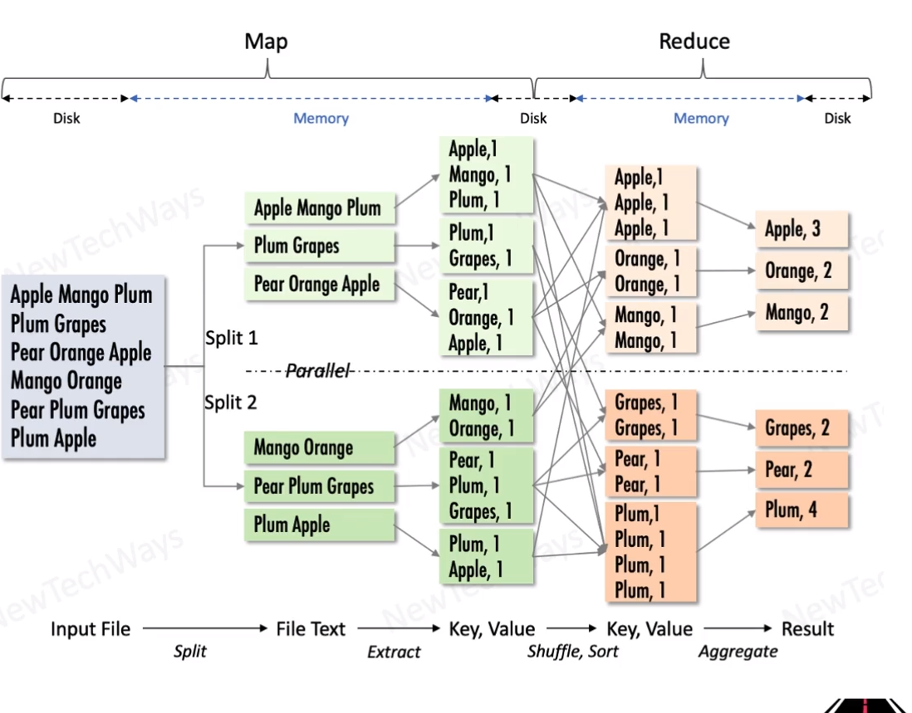

# Map Reduce (processing algorithm)

- Parallel file processing on hadoop cluster
- Processing code executes on datanodes
- Input/Output sources
  - HDFS
  - HBase
  - Cassandra
- Map phase
  - Filtering and transformation
- Reduce Phase
  - shuffles map output across nodes
  - groups related information
  - computes aggregate data

