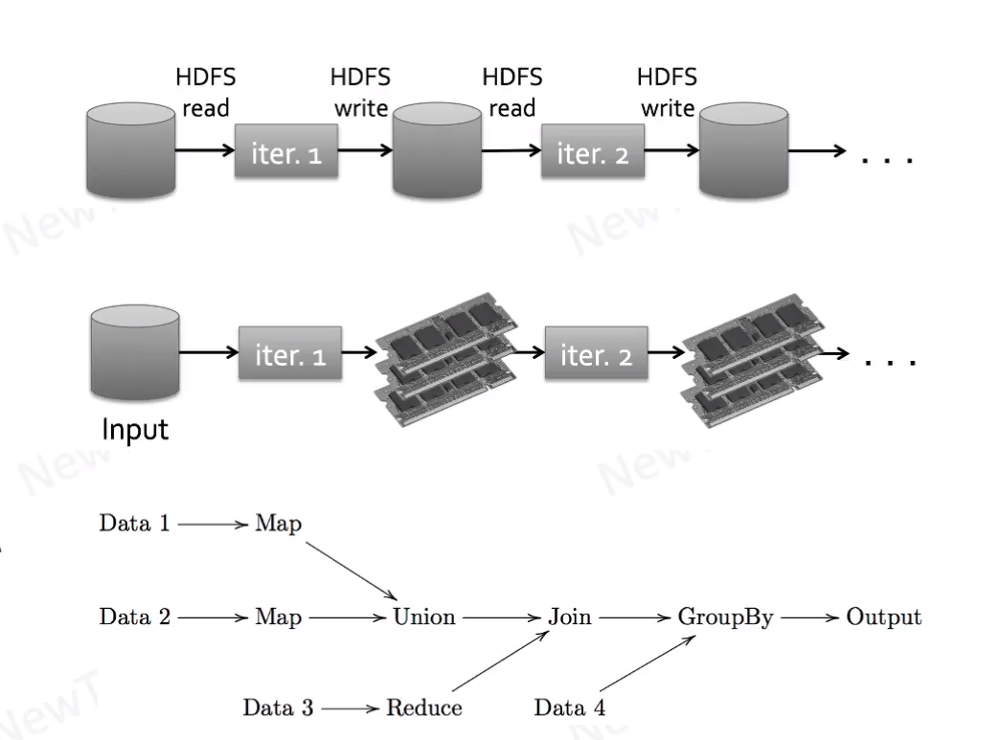

# Apache Spark

- Evolution of Map-Reduce
- in memory
  - 10x to 100x times faster
- DAG of operations
  - multiple operations in a DAG
  - multiple inbuilt operations
- Interactive
  - interactive shell in Scala/Python/R
- In build libraries for
  - SQL Interface
  - Machine Learning
  - Graph Processing
  - Streaming

