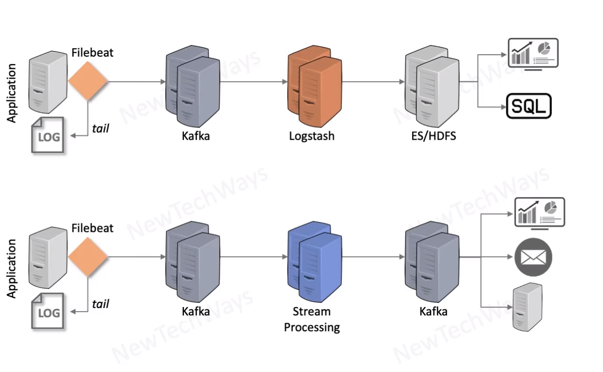

# Streaming Processing

- Low latency
  - keep data moving
- high throughput
  - multiple sources
- Event issues
  - event delay
  - out-of-order
  - missing
- Fault tolerance
  - event replay
- high availability
- processing engine
  - storm  
  - flink
  - spark (micro batching)
- buffer
  - kafka

